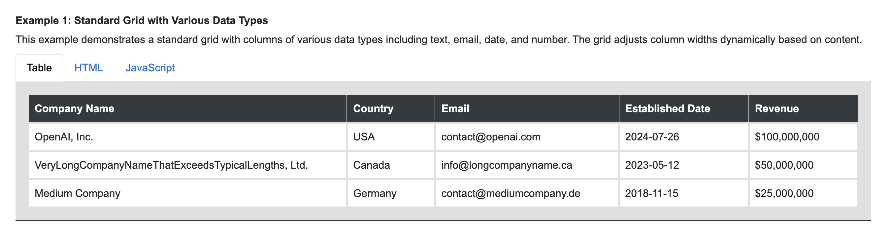

# AutoFitGrid

AutoFitGrid is a robust JavaScript library for dynamically adjusting grid column widths based on content. It ensures that columns are optimally sized to fit their content, improving the layout and readability of grid-based interfaces.

## Features

- Dynamic column width adjustment
- Support for various data types including text, email, date, and number
- Option to distribute remaining space equally across columns
- Customizable wrap ratios for different data types
- Fixed-width columns support
- Easy to integrate and configure

## Installation

You can install AutoFitGrid using npm:

```sh
npm install auto-fit-grid
```

## Example

https://autofitgrid.codeutility.io



## Usage

### Basic Usage

First, include the AutoFitGrid script in your HTML file:

```html
<script src="node_modules/auto-fit-grid/dist/auto-fit-grid-1.0.1.min.js"></script>
```

Next, create a grid container with header and column elements:

```html
<div class="grid-container" data-distribute-remaining-space="true">
    <div class="grid-header" data-type="text">Company Name</div>
    <div class="grid-header" data-type="text">Country</div>
    <div class="grid-header" data-type="email">Email</div>
    <div class="grid-header" data-type="date">Established Date</div>
    <div class="grid-header" data-type="number">Revenue</div>

    <div class="grid-item">OpenAI, Inc.</div>
    <div class="grid-item">USA</div>
    <div class="grid-item">contact@openai.com</div>
    <div class="grid-item">2024-07-26</div>
    <div class="grid-item">$100,000,000</div>
</div>
```

Then, initialize AutoFitGrid for your grid container:

```javascript
document.addEventListener('DOMContentLoaded', function() {
    new AutoFitGrid({
        container: document.querySelector('.grid-container'), // Required
        headerSelector: '.grid-header', // Required
        columnSelector: '.grid-item', // Required

        defaultWrapRatios: { // Optional, default: { text: 4.5, date: 8.0, datetime: 7.0, number: 7.0, email: 12.0 }
            text: 4.5,
            date: 8.0,
            datetime: 7.0,
            number: 7.0,
            email: 12.0,
        },
        defaultMinWidth: 50, // Optional, default: 50
        defaultMaxWidth: Infinity, // Optional, default: Infinity
        adjustmentThreshold: 200, // Optional, default: 200
        distributeRemainingSpace: true // Optional, default: true
    });
});
```

### Using AutoFitGrid in ReactJS

First, install AutoFitGrid using npm:

```sh
npm install auto-fit-grid
```

Then, import and use it in your React component:

```javascript
import React, { useEffect, useRef } from 'react';
import AutoFitGrid from 'auto-fit-grid';

const GridComponent = () => {
    const gridContainerRef = useRef(null);

    useEffect(() => {
        if (gridContainerRef.current) {
            new AutoFitGrid({
                container: gridContainerRef.current,
                headerSelector: '.grid-header',
                columnSelector: '.grid-item',
            });
        }
    }, []);

    return (
        <div className="grid-container" ref={gridContainerRef} data-distribute-remaining-space="true">
            <div className="grid-header" data-type="text">Company Name</div>
            <div className="grid-header" data-type="text">Country</div>
            <div className="grid-header" data-type="email">Email</div>
            <div className="grid-header" data-type="date">Established Date</div>
            <div className="grid-header" data-type="number">Revenue</div>

            <div className="grid-item">OpenAI, Inc.</div>
            <div className="grid-item">USA</div>
            <div className="grid-item">contact@openai.com</div>
            <div className="grid-item">2024-07-26</div>
            <div className="grid-item">$100,000,000</div>
        </div>
    );
};

export default GridComponent;
```

### Using AutoFitGrid in AngularJS

First, install AutoFitGrid using npm:

```sh
npm install auto-fit-grid
```

Then, import and use it in your Angular component:

```javascript
import angular from 'angular';
import AutoFitGrid from 'auto-fit-grid';

const app = angular.module('gridApp', []);

app.controller('GridController', ['$scope', '$element', function($scope, $element) {
    $scope.$on('$viewContentLoaded', function() {
        new AutoFitGrid({
            container: $element[0].querySelector('.grid-container'),
            headerSelector: '.grid-header',
            columnSelector: '.grid-item',
        });
    });
}]);

app.component('gridComponent', {
    template: `
        <div class="grid-container" data-distribute-remaining-space="true">
            <div class="grid-header" data-type="text">Company Name</div>
            <div class="grid-header" data-type="text">Country</div>
            <div class="grid-header" data-type="email">Email</div>
            <div class="grid-header" data-type="date">Established Date</div>
            <div class="grid-header" data-type="number">Revenue</div>

            <div class="grid-item">OpenAI, Inc.</div>
            <div class="grid-item">USA</div>
            <div class="grid-item">contact@openai.com</div>
            <div class="grid-item">2024-07-26</div>
            <div class="grid-item">$100,000,000</div>
        </div>
    `,
    controller: 'GridController'
});
```

### Options

- `container`: The grid container element (required).
- `defaultWrapRatios`: Object defining wrap ratios for different data types (optional).
- `defaultMinWidth`: Default minimum width for columns (optional).
- `defaultMaxWidth`: Default maximum width for columns (optional).
- `adjustmentThreshold`: Threshold for width adjustment in pixels (optional).
- `headerSelector`: CSS selector for header elements (optional).
- `columnSelector`: CSS selector for column elements (optional).
- `showDebug`: Boolean to enable or disable debug logging (optional).
- `distributeRemainingSpace`: Boolean to enable or disable distribution of remaining space (optional).

## License

This project is licensed under the MIT License.

## Author

Hien Tran

## Links

- [NPM](https://www.npmjs.com/package/auto-fit-grid)
- [GitHub Repository](https://github.com/dinhhientran/auto-fit-grid)
- [README](https://github.com/dinhhientran/auto-fit-grid/blob/main/README.md)
